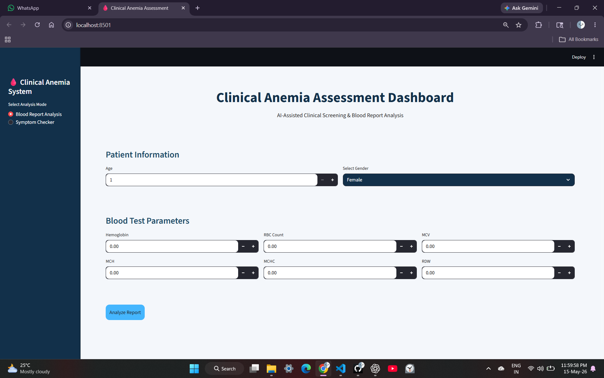
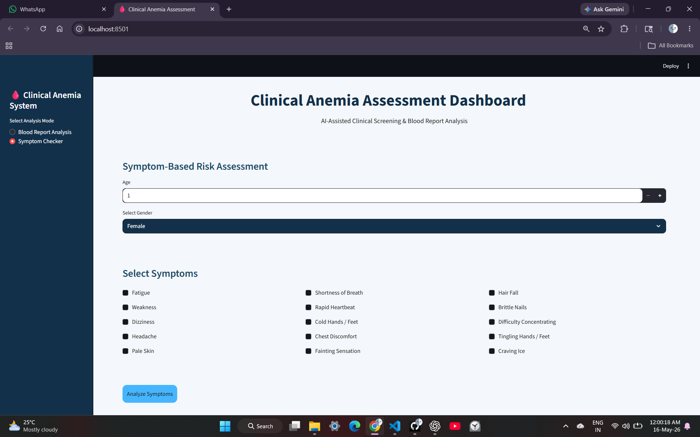
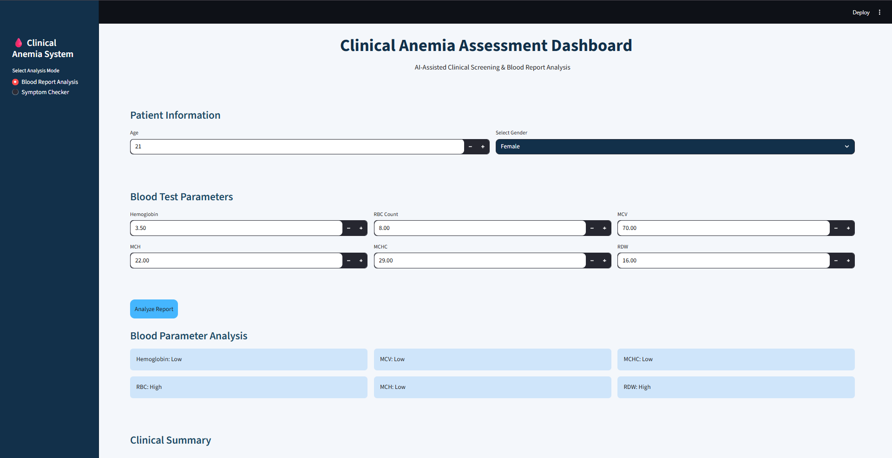
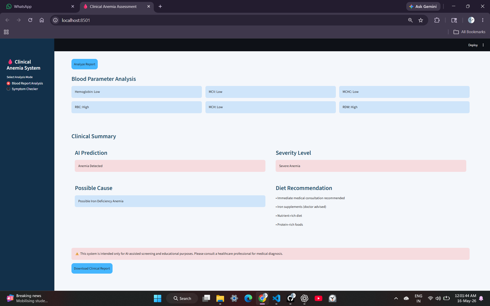

# 🩸 Clinical Anemia Assessment Dashboard

AI-Assisted Clinical Screening & Blood Report Analysis System

---

## 🌙 Project Overview

The **Clinical Anemia Assessment Dashboard** is an AI-powered healthcare screening application developed using **Machine Learning, Python, Streamlit, and clinical parameter analysis**.

This project helps users:

* Analyze blood test reports
* Check possible anemia risk through symptoms
* Understand severity levels
* Identify possible causes
* Receive diet recommendations
* Generate downloadable PDF clinical reports

The system was designed with a professional hospital-style dashboard UI to simulate a real-world healthcare screening workflow.

---

# 🚀 Live Website

🔗 **Website Link:**
https://anemiaaiproject-62gmwd8zr7kwjdxwxf6pfr.streamlit.app/

---

# 📸 Project Screenshots

## 🖥️ Dashboard UI






---

# ✨ Features

## 🩸 Blood Report Analysis

* Hemoglobin analysis
* RBC count analysis
* MCV analysis
* MCH analysis
* MCHC analysis
* RDW analysis
* AI-based anemia prediction
* Severity estimation
* Possible cause analysis
* Diet recommendation system

---

## 🩺 Symptom Checker Mode

Users can assess possible anemia risk through symptoms such as:

* Fatigue
* Weakness
* Dizziness
* Pale Skin
* Headache
* Shortness of Breath
* Rapid Heartbeat
* Cold Hands/Feet
* Hair Fall
* Brittle Nails
* Tingling Hands/Feet
* Craving Ice

The system estimates:

* Possible anemia risk
* Possible severity level
* Medical advisory warning

---

## 📄 PDF Report Generation

The dashboard generates downloadable clinical reports containing:

* AI prediction
* Severity level
* Possible cause
* Diet recommendations

---

# 🧠 Machine Learning Models Used

* Random Forest Classifier
* Logistic Regression

---

# 🛠️ Technologies Used

| Technology   | Purpose              |
| ------------ | -------------------- |
| Python       | Core programming     |
| Streamlit    | Web dashboard        |
| Scikit-learn | Machine learning     |
| Pandas       | Data handling        |
| NumPy        | Numerical operations |
| ReportLab    | PDF generation       |
| Git & GitHub | Version control      |

---

# 📂 Project Structure

```plaintext
Anemia_AI_Project/
│
├── app.py
├── train_model.py
├── anemia.csv
├── requirements.txt
│
├── models/
│   └── anemia_model.pkl
│
└── README.md
```

---

# ⚙️ Installation

## 1️⃣ Clone Repository

```bash
git clone git@github.com:Shrebs/Anemia_AI_Project.git
```

---

## 2️⃣ Open Project Folder

```bash
cd Anemia_AI_Project
```

---

## 3️⃣ Install Dependencies

```bash
pip install -r requirements.txt
```

---

## 4️⃣ Run Application

```bash
streamlit run app.py
```

---

# 📊 Clinical Parameters Used

The AI model uses:

* Gender
* Hemoglobin
* MCH
* MCHC
* MCV

Additional clinical interpretation includes:

* RBC Count
* RDW
* Symptom analysis
* Age-based context

---

# ⚠️ Medical Disclaimer

This project is intended only for:

* Educational purposes
* AI-assisted screening
* Demonstration purposes

This application is **NOT a replacement for professional medical diagnosis**.

Users are advised to consult healthcare professionals and undergo proper laboratory testing for accurate medical evaluation.

---

# 🔮 Future Improvements

Potential future upgrades include:

* Explainable AI integration
* Patient login system
* Clinical database integration
* Advanced analytics dashboards
* Dark mode UI
* Multi-disease prediction support
* Cloud database storage
* Doctor recommendation system

---

# 👩‍💻 Author

### Shreya B S

Data Science Engineering Student

Built with curiosity, persistence, debugging struggles, and lots of coffee ☕

---

# 🌟 Acknowledgement

Special thanks to ChatGPT (Ray) for guidance, debugging assistance, UI improvement suggestions, and project development support throughout the creation of this application.

---

# ⭐ If you liked this project

Consider giving this repository a star ⭐
